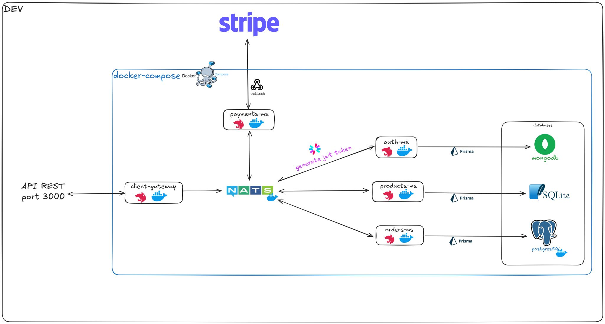
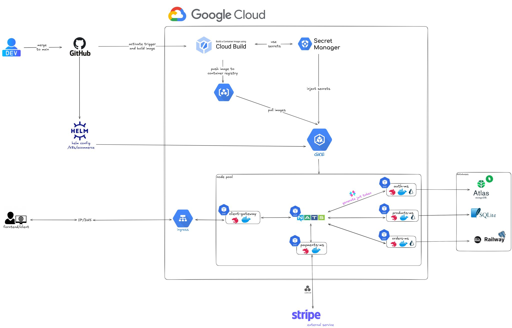

# 📘 Documentación Técnica del Curso de Microservicios con NestJS

## 🔍 Descripción General

Este proyecto representa una implementación completa de arquitectura de microservicios utilizando **NestJS**, Docker, NATS, JWT, Kubernetes y Google Cloud. Cada microservicio se encuentra desacoplado y contenido en submódulos Git para favorecer un desarrollo escalable y mantenible.

---

## 📂 Estructura del Repositorio

```bash
nest-microservices-devmalagan-products-launcher/
├── README.md                     # Documentación principal
├── .env.template                 # Plantilla de variables de entorno
├── docker-compose.yml           # Configuración para entorno de desarrollo
├── docker-compose.prod.yml      # Configuración para entorno de producción
├── push-images.sh               # Script para subir imágenes a un container registry
├── K8s.README.md                # Documentación exclusiva de Kubernetes
├── resources/                   # Diagramas e imágenes del proyecto
├── k8s/
│   └── ecommerce/               # Chart de Helm para orquestación
│       ├── Chart.yaml
│       ├── values.yaml
│       └── templates/
├── auth-ms/                     # Submódulo - Microservicio de autenticación
├── client-gateway/              # Submódulo - API Gateway
├── orders-ms/                   # Submódulo - Microservicio de órdenes
├── payments-ms/                 # Submódulo - Microservicio de pagos
└── products-ms/                 # Submódulo - Microservicio de productos
```

Cada carpeta `*-ms/` representa un submódulo Git independiente para facilitar el versionamiento y control granular del desarrollo.

---

## 🧰 Instalación del Proyecto (Entorno Dev)

### 1. Clonar el repositorio principal
```bash
git clone <main-repo-url>
cd <main-repo-folder>
```

### 2. Crear archivo `.env`
Basado en `.env.template`.

### 3. Inicializar los submódulos
```bash
git submodule update --init --recursive
```
Este comando es **obligatorio** después de clonar el repositorio principal para inicializar y sincronizar todos los submódulos correctamente.

### 4. Levantar el entorno de desarrollo
```bash
docker compose up --build
```

---

## 🏗️ Configuración para Producción (Entorno Prod)

### 1. Clonar el repositorio y crear `.env`
```bash
git clone <main-repo-url>
cd <main-repo-folder>
cp .env.template .env
```

### 2. Construcción de imágenes optimizadas
```bash
docker compose -f docker-compose.prod.yml build
```

---

## 🔄 Guía para Trabajar con Submódulos Git

### ➕ Añadir un submódulo
```bash
git submodule add <repository_url> <directory_name>
git add .
git commit -m "Add submodule"
git push
```

### 🧪 Inicializar submódulos al clonar
```bash
git submodule update --init --recursive
```

### 🔁 Actualizar submódulos a la última versión del repositorio remoto
```bash
git submodule update --remote
```

### ⚠️ Reglas Importantes
- **Siempre hacer commit/push en el submódulo antes que en el repositorio principal.**
- Si no respetas ese orden, podrías perder la referencia del submódulo y generar conflictos innecesarios.

---

## 📈 Tabla de Versiones de Submódulos

| Microservicio         | Repositorio GitHub                                    | Rama/Tag        | Descripción                           |
|-----------------------|--------------------------------------------------------|------------------|---------------------------------------|
| `auth-ms`             | `github.com/usuario/auth-ms`                          | `main`           | Servicio de autenticación y JWT       |
| `client-gateway`      | `github.com/usuario/client-gateway`                   | `main`           | Gateway REST para clientes            |
| `orders-ms`           | `github.com/usuario/orders-ms`                        | `main`           | Gestión de órdenes y su estado        |
| `payments-ms`         | `github.com/usuario/payments-ms`                      | `main`           | Integración con Stripe y Webhooks     |
| `products-ms`         | `github.com/usuario/products-ms`                      | `main`           | CRUD de productos                     |

> 🧠 Sugerencia: en producción, considera usar ramas estables (`release/1.0.x`, `hotfix/x`) para cada submódulo.

---

## 🛠 Recomendaciones Adicionales

✅ Usa variables `.env` por entorno (`.env.dev`, `.env.prod`) y gestiona secretos con GCP Secret Manager  
✅ Documenta comandos frecuentes en un `Makefile` o script de automatización  
✅ Incluye `README.md` individual en cada microservicio para fomentar autonomía en su uso  
✅ Si implementas CI/CD (como GitHub Actions), automatiza la actualización de submódulos y despliegue en GKE

---

## 📸 Diagramas del Proyecto

### Entorno de Desarrollo
  

### Entorno de Producción


---